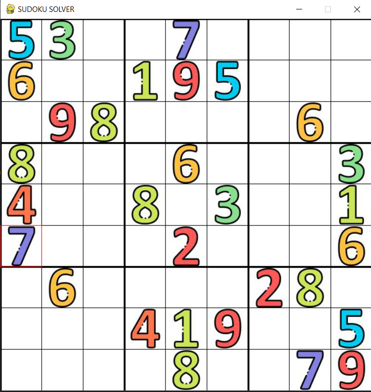
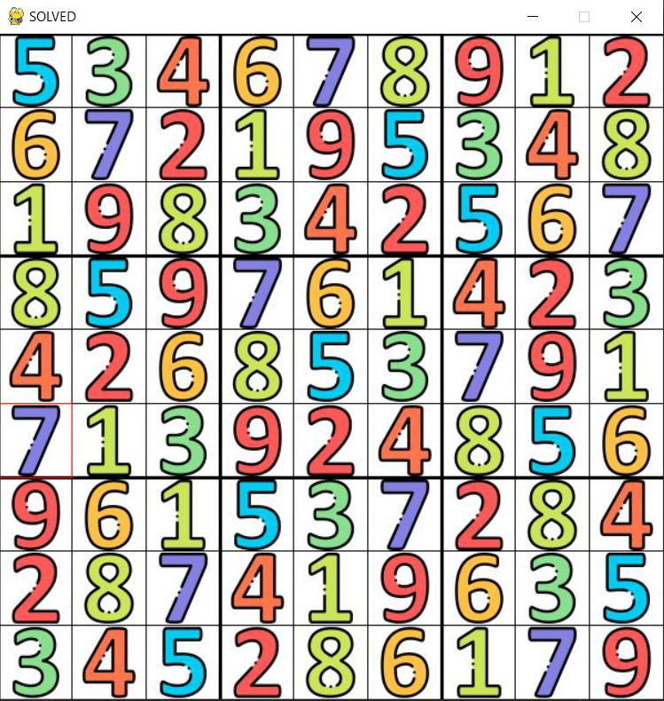

# Instructions

1. Enter the digits using mouse and digit keys on key-board.
2. To erase a digit, simply use zero(0) key.
3. Press space-bar to start solving the entered puzzle.

# Screenshots

### Before

### After

